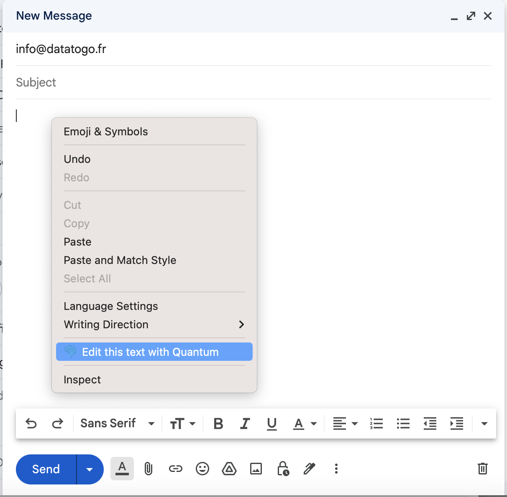
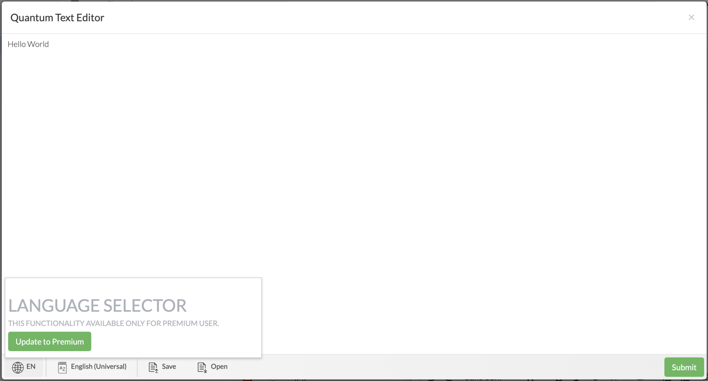

# # Quantum Text Editor Chrome Extension

Welcome to the repository of the Quantum Text Editor Chrome Extension. This extension enhances your browsing experience by adding a new line "Edit this text with quantum" to the context menu when you are in any text boxes, allowing you to edit the text using the Quantum Text Editor.

## Features

- Adds "Edit this text with quantum" option in the context menu within any text boxes.
- Opens the Quantum Text Editor for an enhanced text editing experience.

## Installation

1. Download or clone this repository to your local machine.
2. Open the Chrome browser and navigate to `chrome://extensions/`.
3. Enable `Developer mode` by toggling the switch in the top right corner.
4. Click on `Load unpacked` and select the project directory to install the extension.

## Usage

1. Right-click inside any text box on a webpage.
2. Select the "Edit this text with quantum" option from the context menu to open the Quantum Text Editor.

## Screenshots

### Context Menu

### Quantum Text Editor

## Contributing

If you would like to contribute to this project, please feel free to fork the repository and submit a pull request, or open an issue to discuss potential changes or fixes.

## Contact

If you have any questions or suggestions, feel free to [open an issue](https://github.com/your-github-username/your-repo-name/issues) or contact me directly at your.email@example.com.

---

Thank you for visiting the repository and showing interest in the Quantum Text Editor Chrome Extension. Feel free to explore, use, and contribute!
